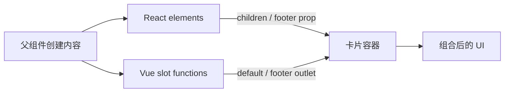

import { ReactDemo } from "./ReactDemo";
import VueDemo from "./VueDemo.vue";

## 核心结论

内容分发让容器组件负责结构，调用方负责具体内容。React 的嵌套 JSX 最终进入 `children` prop；Vue 用默认、具名和作用域 slot 把内容出口变成模板级协议。

## 组合流程



## 最小代码

```tsx title="React：children 加具名元素 prop"
function Card({ children, footer }: CardProps) {
  return <article>{children}<footer>{footer}</footer></article>;
}

<Card footer={<button>关注</button>}>个人简介</Card>
```

```vue title="Vue：默认与具名 slot"
<!-- ProfileCard.vue -->
<article>
  <slot />
  <footer><slot name="footer" /></footer>
</article>

<!-- 调用方 -->
<ProfileCard>
  个人简介
  <template #footer><button>关注</button></template>
</ProfileCard>
```

## 在线观察

两个父组件向同一个卡片结构传入正文和底部操作。

### React

<div class="not-prose"><ReactDemo client:visible /></div>

### Vue 3

<div class="not-prose"><VueDemo client:visible /></div>

## 什么时候使用

| 需求 | React | Vue 3 |
| --- | --- | --- |
| 单个主要内容区 | `children` | 默认 slot |
| 多个具名区域 | 元素 prop，如 `footer` | 具名 slot |
| 子组件把数据交给内容模板 | render prop | 作用域 slot |

内容分发解决“谁提供 UI”，普通数据和事件仍使用[组件通信](/component-communication/)。
