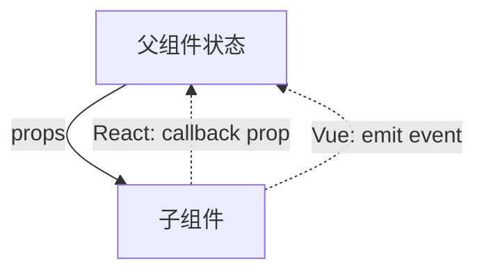

import { ReactDemo } from "./ReactDemo";
import VueDemo from "./VueDemo.vue";

## 核心结论

两边都遵循单向数据流：父组件通过 props 向下传值，子组件通过一个明确的通知边界请求父组件更新。React 把通知表示成函数 prop，Vue 把它表示成组件事件。

## 数据流



## 最小代码

```tsx title="React：子组件调用回调 prop"
function MessageInput({ onSend }: { onSend: (value: string) => void }) {
  return <button onClick={() => onSend("hello")}>发送</button>;
}

<MessageInput onSend={setMessage} />;
```

```vue title="Vue：子组件声明并触发事件"
<script setup lang="ts">
const emit = defineEmits<{ send: [value: string] }>();
</script>

<template><button @click="emit('send', 'hello')">发送</button></template>

<!-- 父组件 -->
<MessageInput @send="message = $event" />
```

## 在线观察

在子组件中输入消息并发送，父组件负责保存最终结果。

### React

<div class="not-prose"><ReactDemo client:visible /></div>

### Vue 3

<div class="not-prose"><VueDemo client:visible /></div>

## 设计边界

- 子组件不应直接修改父组件拥有的状态。
- React 的 `onSend` 只是普通函数；Vue 的 `send` 是组件公开事件协议。
- 回调引用是否需要稳定属于性能问题，不属于通信机制本身，见[useCallback](/callback/)。
- 跨越很多组件层级时，再考虑[Context 与 provide/inject](/context/)。
