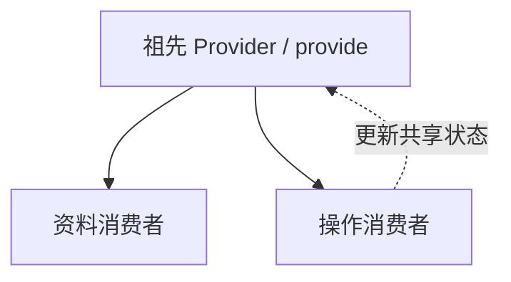

import { ReactDemo } from "./ReactDemo";
import VueDemo from "./VueDemo.vue";

## 核心结论

Context 和 provide/inject 都用于把依赖提供给后代组件，而不是替代所有状态管理。React 消费者跟随 Provider 的 `value` 更新；Vue 通常提供一个响应式 ref 或 reactive 对象，消费者读取同一引用。

## 依赖注入关系



## 最小代码

```tsx title="React：Provider value 与 useContext"
const UserContext = createContext<UserContextValue | null>(null);

<UserContext value={{ user, setUser }}>
  <UserProfile />
</UserContext>

const context = useContext(UserContext);
```

```ts title="Vue：类型安全的 InjectionKey"
export const userKey: InjectionKey<Ref<User>> = Symbol("user");

provide(userKey, user);
const user = inject(userKey);
```

## 在线观察

资料卡与操作面板没有直接传值关系，但会读取并更新同一个用户上下文。

### React

<div class="not-prose"><ReactDemo client:visible /></div>

### Vue 3

<div class="not-prose"><VueDemo client:visible /></div>

## 使用边界

- 优先用 props 表达局部、明确的数据流；层级很深或依赖具有全局语义时再使用上下文。
- React Provider 的对象 `value` 每次重建都可能推动消费者更新，可按实际性能问题拆分 Context 或稳定 value。
- Vue 建议提供响应式引用，并把修改方法一起封装，避免消费者随意破坏不变量。
- 缺少 Provider 时应尽早抛出有语义的错误，而不是让 `undefined` 在深层传播。

局部通信见[Props / Callback 与 props / emit](/component-communication/)。
