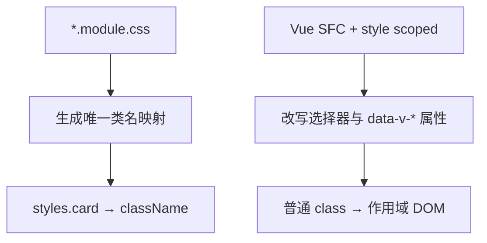

import { ReactDemo } from "./ReactDemo";
import VueDemo from "./VueDemo.vue";

## 核心结论

两种方案都在构建阶段避免局部类名冲突。CSS Modules 把类名映射显式导入 JavaScript；Vue SFC 的 `scoped` 同时改写模板属性和 CSS 选择器。

## 构建流程



## 最小代码

```tsx title="React：显式导入模块映射"
import styles from "./Card.module.css";

export function Card() {
  return <article className={styles.card}>内容</article>;
}
```

```vue title="Vue：SFC scoped 样式"
<template><article class="card">内容</article></template>

<style scoped>
.card { border: 1px solid currentColor; }
</style>
```

## 在线观察

两个卡片具有相同结构和视觉效果，但绑定生成类名的方式不同。

### React

<div class="not-prose"><ReactDemo client:visible /></div>

### Vue 3

<div class="not-prose"><VueDemo client:visible /></div>

## 使用边界

| 问题 | CSS Modules | Vue scoped |
| --- | --- | --- |
| 类名如何引用 | `styles.name` | 普通字符串 class |
| 样式位置 | 通常独立 CSS 文件 | 通常与组件同一 SFC |
| 隔离方式 | 构建时重命名类名 | 属性选择器限定范围 |
| 深层子组件 | 需显式共享类名/API | 使用 `:deep()` 时要谨慎 |

主题值和运行时数据不要生成大量动态类名，可继续阅读[CSS 变量动态样式](/dynamic-styles/)。
