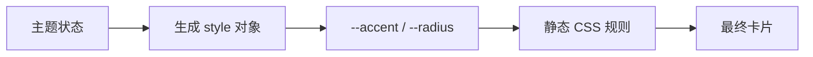

import { ReactDemo } from "./ReactDemo";
import VueDemo from "./VueDemo.vue";

## 核心结论

当样式值来自运行时数据时，可以把少量动态值放进 CSS 自定义属性，把布局、交互态和响应式规则继续留在 CSS 中。React 与 Vue 的主要差异只是 style 对象的生成和绑定语法。

## 状态到样式



## 最小代码

```tsx title="React：扩展 CSSProperties"
const style = {
  "--accent": theme.accent,
  "--radius": `${theme.radius}px`,
} as CSSProperties & Record<`--${string}`, string>;

return <article style={style} className="card" />;
```

```vue title="Vue：computed 生成样式对象"
const cardStyle = computed(() => ({
  "--accent": theme.value.accent,
  "--radius": `${theme.value.radius}px`,
}));

// template: <article class="card" :style="cardStyle" />
```

## 在线观察

切换主题会同时改变强调色、背景与圆角，CSS 结构保持不变。

### React

<div class="not-prose"><ReactDemo client:visible /></div>

### Vue 3

<div class="not-prose"><VueDemo client:visible /></div>

## 选择规则

- 离散且有语义的视觉状态优先使用 class，如 `is-active`。
- 连续数值、用户颜色或设计令牌适合 CSS 变量。
- 不要把所有静态 CSS 都搬进 style 对象；伪类、媒体查询和级联仍应由 CSS 表达。
- 动态值进入 `url()` 等敏感位置前需要验证，避免把任意输入直接拼入样式。

组件级样式隔离见[CSS Modules 与 scoped](/css-modules/)。
