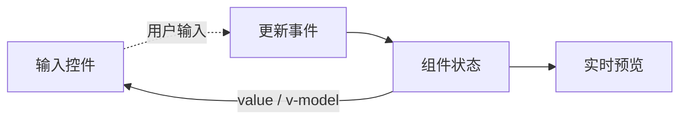

import { ReactDemo } from "./ReactDemo";
import VueDemo from "./VueDemo.vue";

## 核心结论

两边都可以让组件状态成为表单的事实来源。React 显式写出 `value → onChange → setter`；Vue 的 `v-model` 是属性绑定与更新事件的语法糖。

## 表单数据流



## 最小代码

```tsx title="React：显式受控输入"
const [name, setName] = useState("");

<input
  value={name}
  onChange={(event) => setName(event.target.value)}
/>
```

```vue title="Vue：v-model 双向绑定"
<script setup lang="ts">
const name = ref("");
</script>

<template><input v-model="name" /></template>
```

## 在线观察

两个表单都实时展示姓名和学习方向。

### React

<div class="not-prose"><ReactDemo client:visible /></div>

### Vue 3

<div class="not-prose"><VueDemo client:visible /></div>

## 常见边界

- React 输入框在受控与非受控模式之间切换会产生警告；初始值应保持类型稳定。
- `v-model` 不是不可解释的“魔法双向绑定”，组件上会展开为 prop 与 `update:*` 事件。
- 表单值转换应放在输入边界，避免业务层同时处理字符串、数字和空值。
- 大型 React 表单可用 React Hook Form 减少整棵表单的受控更新，见[表单校验实践](/form-validation/)。
