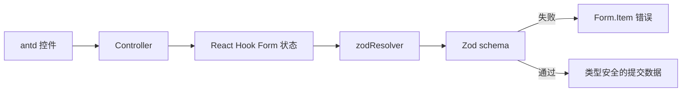

import { FormDemo } from "./FormDemo";

## 职责分层

antd、React Hook Form 和 Zod 不应重复做同一件事：antd 负责控件与反馈，RHF 保存字段状态并组织提交，Zod 是校验与类型的唯一事实来源。



## 最小连接代码

```tsx title="RHF 以 Zod schema 为校验源"
const form = useForm<ProfileFormValues>({
  resolver: zodResolver(profileSchema),
  defaultValues,
  mode: "onBlur",
});

<Controller
  name="email"
  control={form.control}
  render={({ field, fieldState }) => (
    <Form.Item validateStatus={fieldState.error ? "error" : undefined}>
      <Input {...field} />
    </Form.Item>
  )}
/>
```

## 在线 Demo

填写并提交表单，观察必填、格式和勾选校验。校验通过后会展示提交函数实际收到的数据。

<div class="not-prose"><FormDemo client:visible /></div>

## 组合原则

- 使用 `zodResolver` 接入 schema，避免手动同步两套校验结果。
- antd 受控组件通过 `Controller` 连接 RHF；`Checkbox` 需要把 `event.target.checked` 转为布尔值。
- `Form.Item` 只负责布局与错误展示，不再配置重复的 `rules`。
- 通过 `z.infer` 从 schema 推导表单类型，让运行时规则与 TypeScript 结构保持一致。

<Callout title="何时不需要这套组合" type="tip">
字段很少、没有复杂校验的表单可以直接使用受控状态。库的价值来自字段规模、性能和校验一致性，而不是表单出现就必须引入。
</Callout>

先复习[受控表单与 v-model](/form-binding/)，再决定是否需要专门的表单状态库。
