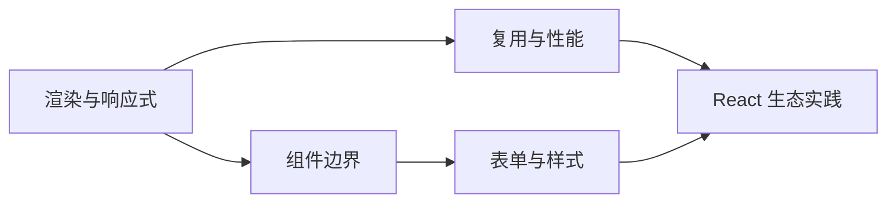

这里不是两份彼此独立的教程，而是一组按知识关系连接起来的对照笔记。每篇都用同一条路径组织：先建立心智模型，再看流程图和最小代码，最后通过真实 Demo 验证结论。

<Cards>
  <Card title="渲染与响应式" href="/render-setup/">
    从 render、setup 和状态更新链路理解两套框架为何会更新。
  </Card>
  <Card title="组件边界" href="/component-communication/">
    对照 props、事件、内容分发、上下文和命令式 ref。
  </Card>
  <Card title="复用与性能" href="/logic-reuse/">
    区分逻辑复用、派生状态、计算缓存与引用稳定性。
  </Card>
  <Card title="表单与样式" href="/form-binding/">
    比较表单数据流、样式隔离和运行时 CSS 变量。
  </Card>
  <Card title="React 生态实践" href="/form-validation/">
    用真实示例学习表单校验、服务端状态缓存和复杂状态更新。
  </Card>
</Cards>

## 推荐阅读顺序

第一次阅读建议依次查看[渲染模型](/render-setup/)、[响应式系统与状态更新模型](/reactivity-models/)和[状态 API](/state/)。它们分别回答组件何时执行、框架如何感知变化，以及日常代码应该怎样更新状态。

> **阅读原则：**先理解“状态怎样推动 UI”，再记 API。代码块展示刻意压缩后的关键路径，可运行 Demo 则用于观察真实框架行为。
