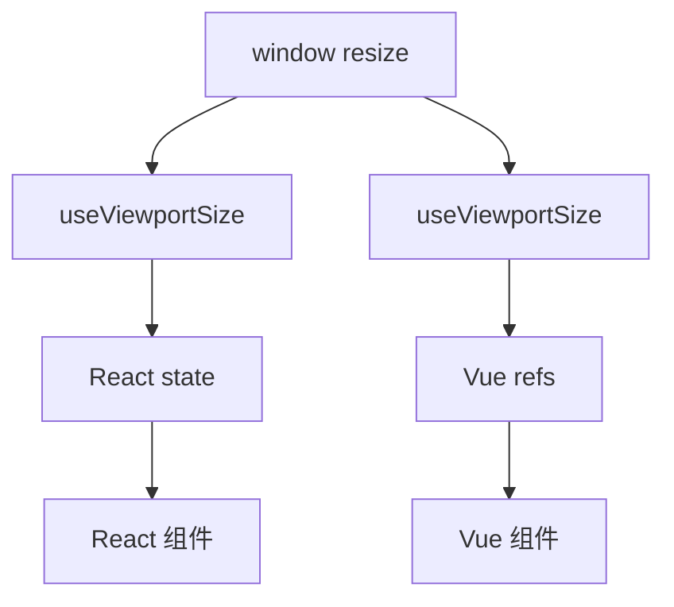

import { ReactDemo } from "./ReactDemo";
import VueDemo from "./VueDemo.vue";

## 核心结论

Custom Hook 和 Composable 都复用有状态逻辑，而不是共享一份组件状态。每个调用者都会获得自己的状态与生命周期连接；差异来自 Hook 参与每次 render，而 Composable 通常在 `setup` 中调用一次。

## 复用边界



## 最小代码

```tsx title="React：Custom Hook 参与 render"
function useViewportSize() {
  const [width, setWidth] = useState(() => window.innerWidth);
  useEffect(() => subscribeResize(setWidth), []);
  return width;
}
```

```ts title="Vue：Composable 返回响应式引用"
export function useViewportSize() {
  const width = ref(window.innerWidth);
  onMounted(() => subscribeResize((value) => (width.value = value)));
  return { width };
}
```

## 在线观察

调整浏览器宽度，两个 Demo 都会更新当前断点。

### React

<div class="not-prose"><ReactDemo client:visible /></div>

### Vue 3

<div class="not-prose"><VueDemo client:visible /></div>

## 设计规则

- React Hook 必须在组件或其他 Hook 顶层按稳定顺序调用。
- Vue Composable 也应在 `setup` 的同步阶段调用需要组件实例的生命周期 API。
- 复用函数返回最小必要状态和操作，不要泄漏内部订阅细节。
- 多个组件需要共享同一实例时，应把状态提升到 Context/provide 或外部 store，而不是仅仅复用函数。

本站同时运行 React Fast Refresh 与 Vue HMR，因此 Vue Demo 使用中性别名调用 composable；普通 Vue 项目可以直接使用 `useViewportSize()`。

跨层共享依赖见[Context 与 provide/inject](/context/)。
