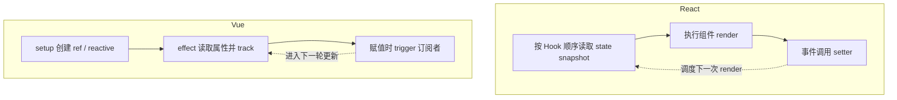

import { ReactDemo } from "./ReactDemo";
import VueDemo from "./VueDemo.vue";

## 核心结论

两边都能做到“状态变化，界面更新”，但保存状态和发现更新的方式不同：Vue 保留稳定的响应式引用并追踪属性读取；React 按 Hook 顺序找回 state，通过 setter 调度下一次 render。

<Callout title="React 算不算响应式？" type="info">
广义上，React UI 会响应状态变化；但在原理对比中，更准确的说法是：**Vue 使用响应式依赖追踪，React 使用状态驱动的声明式更新模型。**
</Callout>

## 两条更新链



## 教学模型

下面是刻意压缩的模型，不是 React Fiber、Hooks 或 Vue 响应式系统的真实源码。

```ts title="Vue：读取时追踪，写入时触发"
function reactive(target) {
  return new Proxy(target, {
    get(object, key) {
      track(object, key, activeEffect);
      return Reflect.get(object, key);
    },
    set(object, key, value) {
      Reflect.set(object, key, value);
      trigger(object, key);
      return true;
    },
  });
}
```

```ts title="React：按顺序读取槽位，setter 排队更新"
function useState(initialValue) {
  const hook = hooks[currentHook] ?? createHook(initialValue);
  const setState = (update) => scheduleRender(hook, update);
  currentHook += 1;
  return [hook.state, setState];
}
```

## 在线观察

两个 Demo 都维护 `count` 和无关的 `theme`。React 不记录组件函数读取了哪个 state；Vue 的 `watchEffect` 只会重新运行读取了变更属性的 effect。

### React

<div class="not-prose"><ReactDemo client:visible /></div>

### Vue 3

<div class="not-prose"><VueDemo client:visible /></div>

## 一张表记住差异

| 观察维度 | Vue 3 | React |
| --- | --- | --- |
| 核心抽象 | 稳定响应式引用与 effect 依赖图 | Hook 槽位、state snapshot 与 render 调度 |
| 状态保存 | `setup` 创建的引用由组件实例持有 | React 在组件对应的数据结构中保存 Hook state |
| 如何感知变化 | 拦截 ref/reactive 的读取与赋值 | 必须调用 setter 提交更新 |
| 是否追踪属性读取 | 是，`track` 记录当前 effect | 否，不记录组件读取了哪个 state 属性 |
| 更新工作 | 触发订阅该属性的 effect | 重新执行相关函数组件并计算 UI |

> **一句话心智模型：**Vue 是“我记得谁读过属性，变化时通知它”；React 是“你用 setter 提交更新，我用新的 state snapshot 再执行组件”。

下一步阅读[状态 API](/state/)比较日常更新写法，或回到[render 与 setup](/render-setup/)复习组件执行边界。
