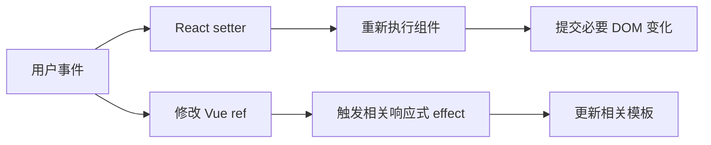

import { ReactDemo } from "./ReactDemo";
import VueDemo from "./VueDemo.vue";

## 核心结论

React 函数组件本身就是一次 render：状态更新后，组件函数会重新执行并计算下一棵 UI。Vue 的 `setup` 更像组件实例的初始化入口，通常只执行一次，后续由响应式依赖触发模板更新。

<Callout title="不要把执行次数等同于 DOM 重建" type="info">
React 重新执行组件函数，不代表整棵真实 DOM 都会重建；Vue 更新模板，也不代表完全不会重新运行组件的更新函数。两边最终都会比较并提交必要的 DOM 变化。
</Callout>

## 更新流程



## 最小代码

```tsx title="React：组件函数随 render 重跑"
function Counter() {
  const [count, setCount] = useState(0);
  console.log("render");

  return <button onClick={() => setCount((n) => n + 1)}>{count}</button>;
}
```

```vue title="Vue：setup 创建一次响应式引用"
<script setup lang="ts">
import { ref } from "vue";

const count = ref(0);
console.log("setup");
</script>

<template>
  <button @click="count += 1">{{ count }}</button>
</template>
```

## 在线观察

两个 Demo 都维护计数和显示模式，并记录逻辑执行次数。分别修改两个状态，观察 React render 次数与 Vue setup 次数。

### React

<div class="not-prose"><ReactDemo client:visible /></div>

### Vue 3

<div class="not-prose"><VueDemo client:visible /></div>

## 选择心智模型

| 问题 | React | Vue 3 |
| --- | --- | --- |
| 组件逻辑何时运行 | 每次 render 执行函数组件 | 创建实例时执行 `setup` |
| 状态如何推动更新 | setter 调度新的 render | ref/reactive 触发依赖它的 effect |
| 事件函数是否重建 | render 时重新创建 | 通常由 `setup` 创建并复用 |

继续阅读[响应式系统与状态更新模型](/reactivity-models/)理解“框架如何知道要更新”，再到[状态 API](/state/)学习日常写法。
