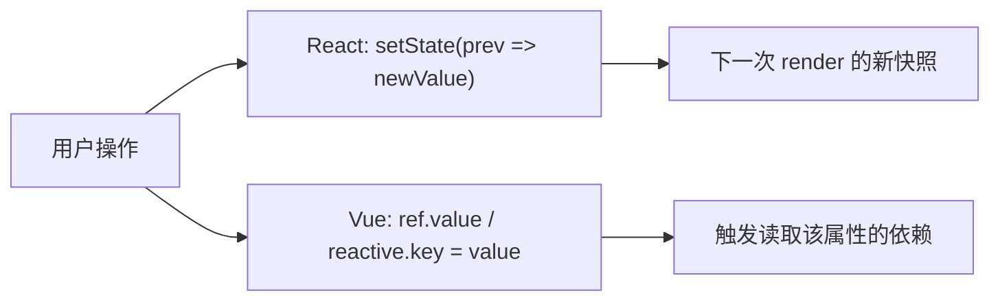

import { ReactDemo } from "./ReactDemo";
import VueDemo from "./VueDemo.vue";

## 核心结论

React state 是一次 render 的快照，更新时应通过 setter 提交新值；Vue 的 `ref` 和 `reactive` 是稳定的响应式容器，可以修改 `.value` 或对象属性。

## 对象更新流程



## 最小代码

```tsx title="React：使用函数式 setter 创建新对象"
const [profile, setProfile] = useState({ name: "小明", score: 0 });

setProfile((current) => ({
  ...current,
  score: current.score + 1,
}));
```

```ts title="Vue：修改响应式容器"
const count = ref(0);
const profile = reactive({ name: "小明", score: 0 });

count.value += 1;
profile.score += 1;
```

## 在线观察

两个计数器维护相同的数字与对象状态。重点观察 React 如何替换对象，Vue 如何修改响应式属性。

### React

<div class="not-prose"><ReactDemo client:visible /></div>

### Vue 3

<div class="not-prose"><VueDemo client:visible /></div>

## 常见误区

- 不要直接修改 React state；旧对象引用可能让 React 无法可靠判断更新边界。
- 解构 `reactive` 对象的基本类型属性会失去响应式连接，需要保留对象访问或使用 `toRefs`。
- 新值依赖旧值时，React 优先使用函数式 setter，避免闭包中的旧快照。
- Vue 模板会自动解包 ref，但普通 TypeScript 代码仍需读取 `.value`。

原理见[响应式系统与状态更新模型](/reactivity-models/)；需要从现有状态计算新值时继续阅读[派生状态](/derived-state/)。
